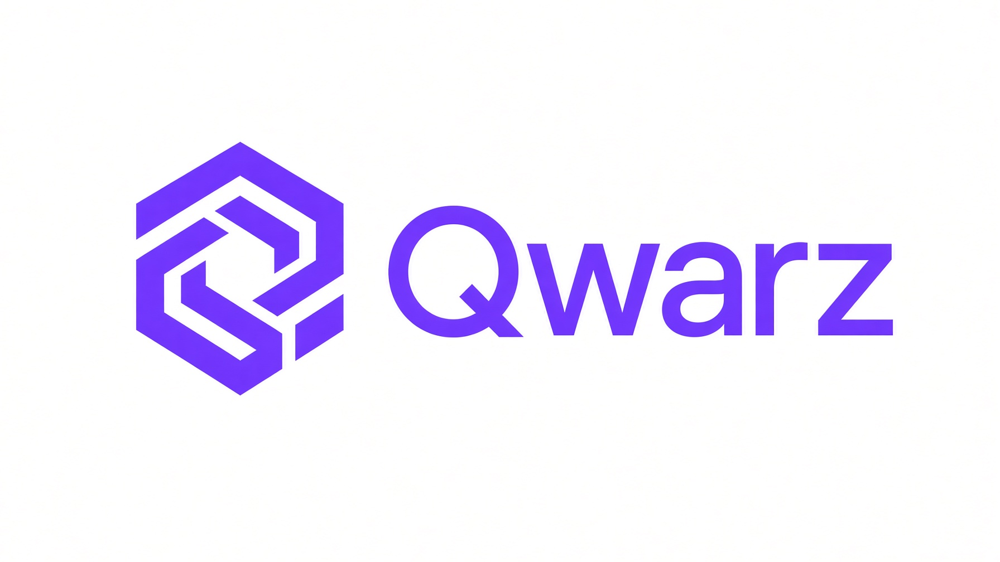

<p align="center"></p>

# Qwarz

Qwarz is an independent inference engine specialized for **Qwen3.8-27B on one
NVIDIA RTX 5090** (32 GB). It serves one persistent, agentic coding session
with a native **262,144-token context**, native image input, and an
OpenAI/Anthropic-compatible HTTP API. A Rust/SQLite supervisor owns sessions,
exact token history, cancellation and recovery; a persistent ExLlamaV3 worker
owns the GPU.

## The stack

Every lever is measured against a same-day control before it ships. The
production stack (`--prefill xqa`, promoted 2026-09-21 after a 37-cell gate;
MTP proposer head 64K added 2026-09-22 after its own 37-cell gate):

| lever | effect |
|---|---|
| EXL3 5.0 bpw artifact | pinned model quantization, hash-verified at every load |
| NVIDIA64 NVFP4 MLP donor | 192 FP4/FP8 matrices + MLP CUDA graphs |
| MTP6 speculative decoding | 6 fixed draft proposals, ~0.70 acceptance on coding |
| MTP proposer head 64K | 65536-token draft head (recalibrated map, pinned hash): −2.5 ms/verify of draft weight reads |
| NVFP4 one-level KV cache | quantized KV (page 256) compresses deep-context reads |
| XQA decode attention | decode kernels + per-layer decode CUDA graphs |
| PRIMS FP8 prefill | large prefills (≥8K) |
| Rendezvous | speculative loop resident on GPU: batched verify, GPU draft chain, embedding table on GPU (+2.5 GB VRAM) |
| Native vision | MM embedding tables aligned to the compute device |

### How the EXL3 artifact and the NVIDIA64 donor combine

There is no merged hybrid artifact: the production model is a **per-module
graft assembled at load time** from two pinned artifacts of the same weights.

| part | source | format |
|---|---|---|
| attention (Q/K/V/O, GDN), embeddings, `lm_head`, MTP head | EXL3 artifact | 5 bpw (head 6-bit, MTP 4-bit) |
| vision tower | EXL3 artifact | BF16, untouched |
| gate/up/down of all 64 layers (192 matrices) | NVIDIA64 donor | NVFP4 (modelopt tensors) |

During load, the MLP loader intercepts ExLlamaV3's `Linear.load`: MLP modules
matching `layers.*.mlp.*_proj` never read their EXL3 tensors — they take NVFP4
tensors from the donor shards and run on Blackwell-native tensor-core
kernels, grafted into the ExLlamaV3 module tree. Everything else loads the
normal EXL3 path. The engine refuses to serve unless donor dimensions match
the EXL3 shapes exactly, exactly 192 modules were replaced, and 64 per-layer
MLP CUDA graphs were captured; donor revision and shard hashes are baked into
the session identity, so swapping either artifact invalidates sessions.

Why this split: MLPs carry roughly two thirds of the forward matmul FLOPs and
NVFP4 is the fastest native format on the RTX 5090, while the
quality-sensitive parts (attention, embeddings, head, MTP) stay on the finer
EXL3 quants. The quality gate measures this exact mix, not each artifact
alone.

NVFP4 touches only those 192 MLP weights — not attention, embeddings,
`lm_head`, MTP or vision. The KV cache is a separate quantization axis
(K8/V4 on `flash`, NVFP4 one-level on `xqa`).

### The MTP proposer head

The MTP **proposer** runs on a 65536-token head (512 complete 128-token
Hadamard groups, 6 bpw) rebuilt from the pinned full head at every load; the
**verifier keeps the full 248320-row head**, so an id outside the map merely
stops being proposable. The map is frequency-calibrated over the full
37-cell matrix corpus (99.6% group coverage) and pinned by SHA-256 in the
session identity; the engine refuses it unless the 512 groups reconstruct
bit-exactly from the full head. Cost: +0.24 GB VRAM; effect: a constant
−2.5 ms/verify of draft weight reads at every context. If the install fails
at boot the service degrades to the full proposer head with a matching
(different) session identity, reported in `/health` as `mtp_head`.

Rollback to the pre-XQA stack: `--prefill flash` in
`integrations/systemd/qwasar.service`, `daemon-reload`, restart.
`QWASAR_RDZ=0` disables the rendezvous path at boot; `QWASAR_HOT64K=0`
disables the 64K proposer head (full 248320-token proposer) at boot.

Pinned artifact: `thelastspark/Qwen3.8-27B-exl3` @
`1a6fe4afb5b921fda9f93fd4b06d6c6d5c99a62c`, three shards, 19.9 GB, SHA-256
verified against the frozen manifest. The NVIDIA64 donor is pinned by hash in
`benchmarks/manifests/nvidia-qwen38-27b-nvfp4.json`; changing model or donor
requires re-pinning and re-validating.

## Expected numbers

Measured samples (2026-09-22, production stack with the 64K proposer head,
37-cell matrix medians, single user, batch 1), not an SLA. Per-cell run
noise: ±5% decode, ±2–3 pp acceptance.

| context | decode (tok/s) | TTFT |
|---|---:|---:|
| 4K | 283 | 0.63 s |
| 32K | 230 | 5.1 s |
| 64K | 232 | 11.1 s |
| 128K | 207 | 26.3 s |
| 256K | 174 | 66.6 s |

- Warm short chat end-to-end: ~156 tok/s decode, TTFT 70–140 ms warm (~1.1 s cold).
- Large prefills (PRIMS path): 5,300–6,800 tok/s.
- MTP acceptance ~0.62–0.70, workload dependent; decode tracks it.
- VRAM: ~27.9 of 32.6 GB peak (~4.5 GB free).

### What the 2026-09-22 head promotion improved

Same-day 37-cell matrix, both arms on the production stack (XQA + KV NVFP4 +
rendezvous), the proposer head as the only delta:

| context | full head (tok/s) | 64K head (tok/s) | decode gain | ms/verify |
|---|---:|---:|---:|---:|
| 4K | 255 | 283 | **+11%** | −2.4 |
| 32K | 219 | 230 | +5% | −2.5 |
| 64K | 198 | 232 | **+17%** | −2.5 |
| 128K | 179 | 207 | **+16%** | −2.5 |
| 256K | 164 | 174 | +6.5% | −2.4 |

TTFT par (±0.2%) at every context; the −2.5 ms/verify is a constant draft
weight-read saving, so the relative gain is largest where cycles are
shortest. Quality held: frozen-checker gate 4/4 — coding 20/32 vs control
19/32, json 4/4, acceptance −2.1 pp (limit ±5), peak VRAM +0.24 GB.

For reference, the whole promoted stack against the pre-XQA flash stack
(same-day A/B, 2026-09-20): decode +35% @32K, +47% @256K, TTFT −3–4%.
Full stats and methodology: `results/20260920-rendezvous/community-stats.md`
and `results/20260922-hot64k-xqa/report.md` (local artifacts).

## Use it

One command on any Linux box with an RTX 5090:

```bash
bash <(curl -fsSL https://raw.githubusercontent.com/QwarzEngine/qwarz/master/scripts/install.sh)
```

The script clones the engine into `~/Documents/llm/qwarz` (or fast-forwards
an existing clone, falling back to the current checkout if the tree is
dirty), builds the `qwarz` CLI and hands control to `qwarz start`. Flags
pass through: `bash <(curl -fsSL ...) --gpu 1 --download`. It does not
install the Rust toolchain, CUDA or the ExLlamaV3 runtime venv (the sibling
`qwen38-exl3-mia` checkout); whatever is missing, `qwarz start` fails fast
with the exact instruction.

From an existing checkout:

```bash
cd /home/rekeyea/Documents/llm/qwarz
cargo run --release --locked -p qwarz -- start   # installs the service and the `qwarz` command
```

```bash
qwarz start      # install/refresh: GPU check, artifact hashes, build, systemd unit; idempotent
qwarz status     # service status                 qwarz logs    — follow the journal
qwarz stop       # stop the service
qwarz explain    # every engine decision, its measurement, its rollback switch, and this boot's live state
```

`qwarz start` detects the GPUs (RTX 5090 only; processes holding the GPU
block it unless they are the running qwasar service, which it restarts),
validates the runtime venv and CUDA, verifies the pinned EXL3 artifact and
NVFP4 donor by SHA-256 (or downloads them with `--download`), builds the
server, installs/refreshes the systemd user unit and waits for the worker.
Non-default paths (`--gpu N`, `--model`, `--python`, `--donor`) generate a
unit with explicit overrides.

Endpoint `http://127.0.0.1:8800/v1`, model `qwasar-qwen38-27b`. Inline image
data URLs are accepted in user messages. One GPU worker: concurrent requests
get 409; Anthropic `count_tokens` does not take the worker.

| client | install | wrapper |
|---|---|---|
| Pi | `python3 scripts/configure_pi.py` | `scripts/pi_qwasar.sh` |
| Codex | `python3 scripts/configure_codex.py` | `scripts/codex_qwasar.sh` |
| OpenCode | `python3 scripts/configure_opencode.py` | `scripts/opencode_qwasar.sh` |
| OMP | `python3 scripts/configure_omp.py` | `scripts/omp_qwasar.sh` |
| Hermes | `python3 scripts/configure_hermes.py` | `scripts/hermes_qwasar.sh` |
| Qwen Code | `python3 scripts/configure_qwen_code.py` | `scripts/qwen_code_qwasar.sh` |
| Claude Code | `python3 scripts/configure_claude.py` | `scripts/claude_qwasar.sh` |

Installers are idempotent, refuse conflicting `qwasar` entries, keep other
providers, and pin background helper roles off the single worker. Select
`qwasar-qwen38-27b` (or the provider equivalent) in each client.

## Development

The runtime tests need `torch` from the donor venv; campaign companion tests
need their local `results/<campaign>/` modules. `tests/conftest.py` skips
whatever cannot import in the current environment, so a plain run stays green
in both:

```bash
uv sync --extra dev --extra benchmark
PYTHONPATH=src /home/rekeyea/Documents/llm/qwen38-exl3-mia/.venv/bin/python -m pytest -q   # full suite
uv run pytest -q                                                                          # without torch modules
cargo test --quiet
```

`qwasar-bench` (Python 3.12) drives the GPU probes:

```bash
QWASAR_PROBE_KIND=decode QWASAR_WORKLOAD=lru \
QWASAR_MODEL_PATH=/home/rekeyea/models/Qwen3.8-27B-EXL3-5.0bpw \
QWASAR_DRAFT_METHOD=mtp QWASAR_CACHE_QUANT=8,4 \
QWASAR_CONTEXTS=32768,131072,262144 QWASAR_REPETITIONS=2 \
./scripts/run_resident_probe.sh
```

Probe families: resident sessions, decode screening, append-only retrieval
sessions, cache fidelity, turn-size matrix, prefill experiments — each with its
own env vars, documented in `docs/benchmarks/`. GPU probes must not run
concurrently with the service. Completed runs publish `run.json`,
`environment.json`, `samples.jsonl` and `quality.json` atomically; exit 2 means
invalid input or environment, exit 3 means a comparison completed but a gate
failed.

## Docs

- [v1 manual](docs/manual-v1.md) — persistence, API, security, performance, rollback
- [Servicio systemd](docs/servicio-systemd.md) — boot, restart, journal
- [Arquitectura v1](docs/arquitectura-v1.md) — Spanish design walkthrough
- [Serving evaluation](docs/benchmarks/2026-09-20-serving-evaluation.md) — the lever campaign
- `docs/qwarz.jpg` — engine icon
- `results/` (local, gitignored) — campaign data, gate decisions, community stats
