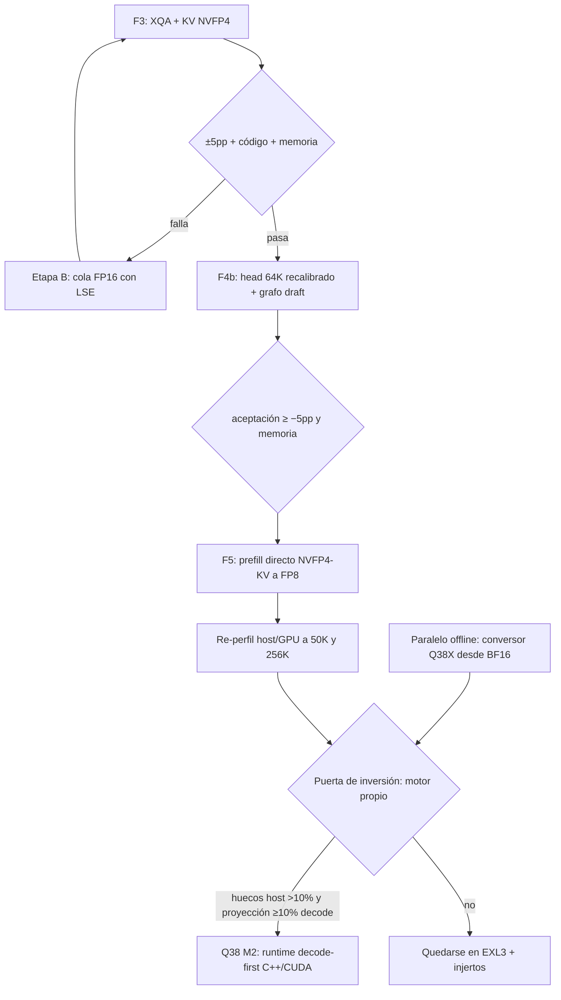

# Evaluación del serving y roadmap hacia el motor propio

Fecha: 2026-09-20. Alcance: Qwen3.8-27B en una RTX 5090, una generación
activa, contexto nativo de 262.144 posiciones. Evaluación de código,
resultados archivados y documentación primaria del repo; no se ejecutaron
nuevas generaciones ni se modificó el servicio. Prioridades fijadas con el
usuario: **decode a contexto largo** (hoy 122 tok/s a 256K) e **ingesta fría
grande** (hoy 67 s a 256K).

**Recomendación.** Cobrar primero las palancas ya medidas sobre la base
ExLlamaV3 productiva, en orden de riesgo creciente: Fase 3 XQA + KV NVFP4,
después head MTP 64K recalibrado con la memoria liberada, y finalmente
prefill directo sin staging FP16. La puerta para invertir en el motor propio
es **numérica**: se abre cuando, agotadas esas palancas, los huecos de
planificación host superen el 10 % del ciclo de verify y la proyección de
ganancia de decode sea ≥ 10 % a calidad comparable. ExLlamaV3 queda como
oráculo y control ejecutable durante toda la transición.

## 1. Dónde está el tiempo hoy

Cifras medidas en el repo; cada una cita su fuente.

### 1.1 Decode a 256K (prioridad 1)

Producción `flash`: EXL3 5 bpw + NVIDIA64 NVFP4 MLP + MTP6 + K8/V4 +
Flash/PRIMS + Attention64. Decode a 256K: **122,3 tok/s** medidos en Fase 2
(`2026-09-11-phase2-results.md`), frente a 101,5 del control EXL3+Triton
(+20,6 %). El perfil de contexto caliente (`2026-09-08-hot-context-profile.md`)
descompone un forward Q=7 (verify MTP6) a 258K:

| Familia | GPU por forward | % del forward |
| --- | ---: | ---: |
| Atención | 24,64 ms | 61,0 % |
| MLP | 9,40 ms | 23,3 % |
| GDN | 5,31 ms | 13,1 % |
| Resto (head, normas, contenedor) | ~1,03 ms | ~2,6 % |

La atención es el dominante absoluto a 256K. El MLP ya está aliviado por
NVIDIA64 NVFP4 (en el perfil híbrido baja a 7,78 ms, 23,9 %). La fase draft
consume 7,89 ms/verify adicionales y su suelo medido es **~2,1 ms de lectura
de pesos** (sub-head 6 bpw + bloque MTP); el resto son huecos de
planificación de ~1–1,4 ms/verify que solo un bucle nativo quita
(`2026-09-11-draft-phase.md`).

A 32K el verify está **casi limitado por host**: 19,9 ms host frente a
20,1 ms GPU en la misma medición. Ese techo de host es la señal más clara de
dónde un runtime nativo ganaría antes que reescribiendo kernels.

### 1.2 Ingesta fría grande (prioridad 2)

TTFT frío a 256K: **67,27 s** en producción `flash` (Fase 2), frente a 133,5 s
del control (−50 %). El perfil de contexto caliente descompone un prefill
Q=8192 a 258K:

| Familia | GPU por forward | % del forward |
| --- | ---: | ---: |
| Atención | 4.156,44 ms | 79,9 % (híbrido) / 67,8 % (producción) |
| MLP | 432,43 ms (híbrido) | 8,1 % |
| GDN | 580,56 ms | 10,9 % |

PRIMS ya cortó el TTFT a la mitad, pero **sigue materializando FP16 antes de
convertir a FP8** (`2026-09-08-upstream-experiments.md`, §3): el parche
P×256 convierte probabilidades de softmax a E4M3 y compensa con Vscale/256,
pero la ruta todavía produce un temporal FP16. Quitar ese staging es la
palanca pendiente de prefill.

Los contadores de hardware (`2026-09-08-attention-hardware-counters.md`)
matizan la hipótesis "Flash está limitado por DRAM": Flash Q=8192 muestra
**85,2 % de actividad Tensor Core y sólo 1,5 % de pico DRAM** (99,2 % de
L2 hit). Es un límite de cómputo/pipeline, no de ancho de banda. La
materialización FP16 sí ejerce presión de DRAM (75–76 %) pero en el kernel
de staging, no en Flash. Un reemplazo debe preservar la eficiencia de
Tensor Core, no solo reducir tráfico.

### 1.3 Memoria

Pico asignado en producción `flash`: **25,63 GiB** (Fase 2), pool de 262.144.
El head MTP 64K medido solo suma **+0,862 GiB** y rompe el criterio de
memoria (≤ control + 0,5 GiB). XQA + KV NVFP4 libera **−0,87 GiB** medidos
(`2026-09-08-upstream-experiments.md`, §4). **La memoria que libera XQA es lo
que paga el head 64K**: combinadas podrían pasar la puerta que cada una falla
aislada.

## 2. Árbol de palancas con evidencia

Cada palanca cita su evidencia medida y su riesgo. Las proyecciones están
etiquetadas como estimación con rango y supuesto explícito; no son mediciones.

### 2.1 Fase 3 — XQA + KV NVFP4 (plan ya escrito)

Plan: `2026-09-14-fase3-xqa-plan.md`. Port del adaptador de septiembre a la
base productiva actual (NVIDIA64 + PRIMS + Attention64).

| Métrica | Base vieja (septiembre) | Fuente | Proyección sobre base nueva |
| --- | --- | --- | --- |
| Decode frío 258K | 135,1 → 171,3 tok/s (+27 %) | `2026-09-08-upstream-experiments.md` §4 | Estimación: +20–30 % sobre 122,3 → ~146–159 tok/s |
| Decode caliente 258K | 141,8 → 184,4 tok/s (+30 %) | mismo | Estimación: +25–35 % sobre 122,3 → ~153–165 tok/s |
| Q128 greedy | 134,9 → 184,4 tok/s (+36,7 %) | mismo | Estimación: +30–40 % |
| Pico asignado | 25,23 → 24,37 GiB (−0,87) | mismo | Medido; reproducible |
| TTFT frío 258K | 107,4 → 107,9 s (≈ igual) | mismo | Riesgo: gather NVFP4→FP16→FP8 en prefill |

**Supuesto de la proyección:** la base nueva ya tiene PRIMS (que la base vieja
no tenía), así que parte del ahorro de TTFT ya está cobrado; la ganancia de
decode debería trasladarse casi íntegra porque XQA reemplaza la ruta de
decode, no la de prefill. **Riesgo principal:** XQA no expone LSE
(verificado en FlashInfer 0.6.18 instalada); la cola FP16 de 2K que reduce el
error de atención de ~4,5 % a ~1,1–1,2 % **solo se validó numéricamente**, sin
latencia ni calidad medidas. Etapa A del plan porta sin cola; Etapa B añade
cola solo si A falla en calidad.

**Riesgo de prefill:** con caché NVFP4 el prefill pasa de K8/V4→FP16 a
NVFP4→FP16→(FP8 PRIMS). El gather de septiembre costaba ~17,5 ms/capa a
258K; PRIMS ahorró ~31–35 % de ingesta. Hay que medir si se pierde parte del
TTFT ganado en Fase 2; es el punto A/3 del plan.

### 2.2 Fase 4b — Head MTP 64K recalibrado + grafo draft + fusión

Medido el 2026-09-11 (`2026-09-11-draft-phase.md`):

| Métrica | Medido | Fuente |
| --- | --- | --- |
| ms/verify | −2,8 constante en todos los contextos | `draft-phase` |
| Decode 32K | +9,8 % | mismo |
| Decode 256K | +2,6 % | mismo |
| Aceptación | −3,9 pp (criterio ±5 pp: pasa) | mismo |
| Memoria | +0,862 GiB (criterio: **falla**) | mismo |
| Grafo CUDA del bucle de 6 pasos | −0,35 ms/verify a 32K, −0,76 a 256K | mismo |
| Fusión de kernels pequeños | −0,09 / −0,18 ms/verify (167 → 127 kernels) | mismo |

**Por qué no se promocionó solo:** la memoria. **Por qué ahora sí:** combinado
con XQA (−0,87 GiB), el head 64K (+0,86 GiB) queda dentro del presupuesto. La
aceptación −3,9 pp se atribuye a un mapa calibrado con solo dos prompts el
2026-09-08; **recalibrar con las cuatro familias de la matriz y JSON** es el
trabajo pendiente antes de reabrirlo. Alternativa sin recalibrar: subir a
96K/128K tokens (ahorro 1,8–2,3 ms en vez de 2,8, aceptación más cercana a la
completa).

La fase draft queda agotada por planificación y fusión: lo que resta es
lectura de pesos (sub-head + bloque MTP ≈ 2,1 ms) y atención. Acumulado
hot64k + grafo + fusión frente a `flash`: −11,6 % a 32K, −4,8 % a 256K.

### 2.3 Fase 5 — Prefill directo sin staging FP16

Hoy PRIMS convierte KV K8/V4→FP16→FP8. Un prefill directo que lea KV NVFP4 y
alimente FP8 sin materializar FP16 quitaría los ~17,44 ms de staging medidos
en Q=128 (`2026-09-08-attention-hardware-counters.md`): ~13,3 % del tiempo de
kernels del target Q=128 en escenario ideal. **Es un escenario ideal de ese
componente, no un pronóstico** (citado textual del doc de contadores).

Los contadores dicen que Flash Q=8192 no está limitado por DRAM (1,5 % pico,
99,2 % L2 hit, 85,2 % Tensor Core). Así que el beneficio de prefill directo
es mayor en turnos cortos (Q=128) que en ingesta grande (Q=8192), donde el
límite es cómputo. **Recomendación del doc de contadores:** comparar prefill
directo K8/V4 existente contra Flash para Q=32/128/256 sobre el mismo KV
largo antes de escribir otro kernel.

### 2.4 Investigaciones separadas (sin promoción inmediata)

- **GDN fusionado:** 13,1 % del forward Q=7 a 258K. La actualización
  recurrente CUDA toma ~0,99 ms/forward; el bloque completo 5,31 ms, así que
  gran parte son proyecciones. Fusionar proyecciones + recurrente + output
  es trabajo de kernel, no de runtime.
- **DFlash2:** la publicación muestra ventajas frente a MTP en H200, pero
  el screen antiguo cambió drafter y caché a la vez, usó 3,5 bpw y otro
  protocolo. Requiere un A/B limpio sobre v1 (`2026-09-07-specialized-engine-research.md` §2).
- **Q38X desde BF16:** la palanca de "mayor calidad" real. Hoy encadenamos
  EXL3 5 bpw + NVFP4 del donante; transcoding encadenaría pérdidas. Un
  conversor offline desde el checkpoint BF16 con selección por sensibilidad
  no toca producción y es la base de calidad del motor propio. Es trabajo
  offline sin GPU de servicio.

## 3. Motor propio: qué sí y qué no

### 3.1 Qué sí aporta

- **Bucle decode nativo:** quita los huecos de 1–1,4 ms/verify de la fase
  draft y el techo host a 32K (19,9 ms host vs 20,1 ms GPU). Es la ganancia
  más temprana y la que el perfil ya justifica.
- **Grafos completos verify+draft:** el grafo del bucle de 6 pasos medido
  da −0,35/−0,76 ms/verify; un grafo completo verify+draft iría más lejos
  pero choca con que los caminos BC de atención y MLP del draft no son
  capturables (terminan en `cudaGraphLaunch`).
- **GDN fusionado:** 13–16 % del forward. Bloque completo con proyecciones,
  recurrente, output y residual.
- **Memoria sellada:** preasignar todo el estado estable y prohibir
  allocaciones en hot-path. Hoy no hay malloc/free en las trazas medidas,
  pero no hay un allocator sellado.
- **Kernels exactos para formas que upstream no sirve bien:** Q24/KV4/D256,
  GQA 6:1, M=1..8, KV cuantizado. FlashInfer `fmha_v2_prefill_sm120` excluye
  GQA; `nvfp4_attention_sm120` usa Q/K/V precuantizados y V transpuesta, no
  consume la caché EXL3 actual sin adaptación.
- **Artefacto Q38X:** base de calidad y de kernels que leen un solo layout.

### 3.2 Qué no aporta

- **No acelera lo GPU-bound a 256K.** La conclusión ya medida en la
  investigación del 07-09 (`2026-09-07-specialized-engine-research.md`):
  "reescribir la coordinación en C++ no garantiza acelerar el trabajo GPU
  dominante". A 256K el verify es 35,4 ms GPU-bound en atención; un bucle
  nativo no mueve esa cifra.
- **El supervisor Rust, protocolo JSONL, parser de tools y persistencia no
  necesitan rehacerse.** El worker ya aísla el backend; el motor propio
  habla el mismo protocolo y el supervisor no cambia.

### 3.3 El camino "el nuestro" es decode-first

El primer hito ejecutable reemplaza solo decode y habla el protocolo JSONL
existente. ExLlamaV3 queda de oráculo. Es el camino Q38 M2→M3 del spec
aprobado (`2026-09-04-qwen38-27b-rtx5090-engine-design.md`), no un big-bang.
Conviene arrancar el conversor Q38X en paralelo (offline, sin GPU de
servicio) porque es la base de calidad y no compite por la GPU.

## 4. Roadmap con puertas de decisión

Leyenda: F3 = Fase 3 del plan de pasos; F4b = retest de la fase draft con
memoria liberada; F5 = prefill directo; Q38 M2 = hito del spec aprobado;
EXL3 + injertos = ruta de bajo riesgo que sigue cobrando palancas sin
reescribir el runtime.

### 4.1 Puerta de inversión del motor propio (numérica)

Se abre si y solo si, **después** de F3 + F4b + F5 medidas y promovidas (o
descartadas con evidencia):

1. **Huecos de host:** el re-perfil muestra que los huecos de planificación
   host superan el 10 % del ciclo de verify a 50K y 256K. Hoy a 32K ya están
   cerca (19,9 ms host vs 20,1 ms GPU); a 256K el verify es GPU-bound, así que
   el umbral debe medirse en el rango de contextos donde el usuario siente la
   experiencia.
2. **Proyección de ganancia:** un prototipo de bucle nativo (grafo completo
   verify+draft + GDN fusionado) proyecta ≥ 10 % de decode a calidad
   comparable, medido contra la base con F3+F4b+F5 ya aplicada. No contra la
   base actual: sería inflar la ganancia con lo que las palancas ya cobran.
3. **Paridad de calidad Q38X offline:** el conversor desde BF16 pasa la
   puerta de calidad (código ≥ control, JSON, ±1 % score agregado, ±1 pp
   tool-call) antes de migrar el runtime. Sin artefacto propio, el motor
   propio no tiene base de calidad distinta de EXL3.

Si la puerta no se abre, la ruta EXL3 + injertos es la respuesta correcta, no
un fracaso: las palancas ya medidas (XQA, head 64K, prefill directo) son la
mayoría de la ganancia disponible a riesgo bajo.

## 5. Métricas de aceptación por fase

Se reutiliza la puerta existente (`2026-09-10-quality-gate.md`):

| Criterio | Regla |
| --- | --- |
| Código | candidato ≥ control en entregas completas sobre 32 celdas |
| JSON | 4/4 |
| Aceptación MTP | mediana de `draft_acceptance` a ±5 pp del control |
| Memoria | pico asignado ≤ control + 0,5 GiB |

Más métricas de experiencia (no gates, solo reporte):

| Métrica | Hoy (producción `flash`) | Fuente |
| --- | --- | --- |
| Decode 256K | 122,3 tok/s | `2026-09-11-phase2-results.md` |
| TTFT frío 256K | 67,27 s | mismo |
| TTFT warm ~50K | 441 ms mediano, 260–550 ms rango | `README.md` |
| Decode warm ~50K | 158 tok/s mediano | `README.md` |
| End-to-end ~50K | 112 tok/s mediano | `README.md` |

La puerta de inversión añade sus propios criterios numéricos (§4.1), que
deben fijarse antes de medir el prototipo, no después.

## 6. Secuencia de trabajo y criterios de decisión

| Etapa | Trabajo concreto | Condición para avanzar |
| --- | --- | --- |
| F3-A | Port XQA a base productiva + puertas numéricas de septiembre + matriz Fase 2 | Puerta ±5 pp pasa |
| F3-B | Cola FP16 2K con LSE (solo si A falla) | Calidad y memoria aceptables |
| F4b | Retest head 64K recalibrado + grafo + fusión sobre la base con XQA | Aceptación ≥ −5 pp y memoria ≤ control + 0,5 GiB |
| F5 | Prefill directo NVFP4-KV a FP8, tabla de chunks por longitud de sufijo | TTFT no peor que PRIMS actual; calidad sin cambio |
| Re-perfil | Nsight Systems/Compute a 50K y 256K sobre la base con F3+F4b+F5 | Huecos host cuantificados por contexto |
| Q38X | Conversor offline desde BF16 + selección por sensibilidad | Puerta de calidad offline pasa |
| Q38 M2 | Worker C++/CUDA decode-first hablando JSONL, ExLlamaV3 como oráculo | Puerta de inversión §4.1 abierta + paridad de estado, tools y recuperación |

En cada A/B: mismo artefacto salvo el ensayo explícito de precisión; mismo
prompt/sampler; warmup fuera de medición; orden intercalado; longitudes reales
y reutilización física verificada. Separar TTFT, primer contenido,
herramienta ejecutable y finalización. Incluir respuestas incorrectas o
truncadas en los resultados. Si cambia la aritmética, comparar logits y
tareas; igualdad greedy aislada no prueba equivalencia de distribución.

## 7. Qué falta medir

- **XQA sobre la base productiva actual** (NVIDIA64 + PRIMS + Attention64).
  La medición de septiembre era sobre la base vieja (MLP56+Flash). El plan
  `2026-09-14-fase3-xqa-plan.md` Etapa A es exactamente esto.
- **Head 64K recalibrado** con las cuatro familias de la matriz y JSON, no
  con dos prompts. Sin recalibrar, la aceptación −3,9 pp es la factura de
  una calibración estrecha, no del mecanismo.
- **Cola FP16 2K con LSE:** solo validada numéricamente. Latencia y calidad
  sin medir. Es la Etapa B condicional de Fase 3.
- **Prefill directo** K8/V4 vs Flash para Q=32/128/256 sobre el mismo KV
  largo. Recomendación del doc de contadores, aún sin ejecutar.
- **Huecos de host a 50K y 256K** sobre la base con todas las palancas
  aplicadas. Es el insumo de la puerta de inversión.
- **Q38X desde BF16:** sin medir. Es la base de calidad del motor propio y
  trabajo offline.

## 8. Referencias

- Arquitectura v1: `docs/arquitectura-v1.md`
- Spec aprobado Q38: `docs/superpowers/specs/2026-09-04-qwen38-27b-rtx5090-engine-design.md`
- Investigación motor propio: `docs/benchmarks/2026-09-07-specialized-engine-research.md`
- Plan de pasos en curso: `docs/benchmarks/2026-09-10-plan-pasos.md`
- Fase 2 resultados: `docs/benchmarks/2026-09-11-phase2-results.md`
- Fase draft: `docs/benchmarks/2026-09-11-draft-phase.md`
- Fase 3 plan XQA: `docs/benchmarks/2026-09-14-fase3-xqa-plan.md`
- Perfil contexto caliente: `docs/benchmarks/2026-09-08-hot-context-profile.md`
- Contadores de atención: `docs/benchmarks/2026-09-08-attention-hardware-counters.md`
- Experimentos upstream: `docs/benchmarks/2026-09-08-upstream-experiments.md`
- Híbrido backend: `docs/benchmarks/2026-09-08-hybrid-backend-results.md`
- NVFP4 vs EXL3: `docs/benchmarks/2026-09-08-nvfp4-results.md`
- Puerta de calidad: `docs/benchmarks/2026-09-10-quality-gate.md`
- README con métricas en vivo: `README.md`
